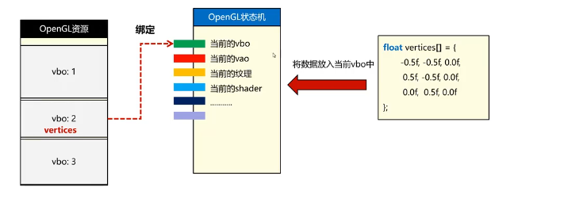

# study-opengl
study OpenGL and make note

[关于项目代码组织结构](./doc/ProjStructure.md)

### 1 NDC(Normalized Device Coordinate)

当屏幕尺寸或者比例发生变化时，显示要跟随屏幕一起拉伸

用-1到1之间的数字表示顶点的坐标，本质就是比例

跟OpenGL交互的时候用NDC坐标

### 2 VBO

Vertex Buffer Object表示了在GPU显存上的一段存储空间对象

VBO的C++中表现为一个uint类型变量，理解为GPU端内存对象的一个id编号

#### 2.1 创建

```glsl
void glGenBuffers(GLsizei n, GLuint* buffers);
```

- n 创建多少个VBO
- buffers 创建出来的VBO编号都放到指向的数组中

VBO的创建仅仅是创建了描述符，还没有真正分配显存

#### 2.2 销毁

```glsl
void glDeleteBuffers(GLsizei n, GLuint* buffers);
```

- n 删除多少个VBO
- buffers 要删除的VBO编号数组

#### 2.3 绑定

将某个资源，与OpenGL状态机中的某个状态插槽进行关联

OpenGL本质就是个巨大的状态机



- 将从GPU申请到的VBO绑定到OpenGL状态机的插槽上
- CPU告诉OpenGL状态机把数据放到当前的VBO上
- OpenGL定位当前VBO插槽绑定的VBO是谁，就把数据放到了VBO上

```glsl
void glBindBuffer(GLenum target, GLuint buffer);
```

- target 要把当前的VBO绑定到OpenGL状态机的哪个状态插槽上
  - GL_ARRAY_BUFFER OpenGL状态机的插槽 当前VBO插槽 
- buffer 绑定的VBO编号 0表示不绑定任何buffer

#### 2.4 填入数据

```glsl
void glBufferData(GLenum target, GLsizeptr size, const void* data, GLenum usage);
```

- target CPU数据要给哪个VBO 告诉OpenGL状态机找哪个状态插槽 
- size 要装入的数据多大(Byte)
- data 要填入的数据指针
- usage 当前buffer的用法
  - GL_STATIC_DRAW VBO模型数据不会频繁改变
  - GL_DYNAMIC_DRAW VBO模型数据会频繁改变

CPU告诉OpenGL要把内存中数据填入到GPU中，直到这时候GPU才会分配显存用来接收这些数据

### 3 多属性数据

顶点中不单单是顶点坐标信息，还包括顶点的颜色数据，OpenGL会根据差值算法对颜色进行过渡

- single buffer策略 每个属性存储为一个VBO
- interleaved buffer交叉策略 所有属性存储为一个VBO

### 4 VAO

在图形学编程中，对于一组纯粹的数据，往往要给出一段描述结构

三角形顶点的某一个属性，我们需要知道的描述信息是
- size 每个顶点几个数字
- type 每个数字是float类型
- stride 每个顶点的数据步长是Byte 为什么有了size和type还需要stride 因为交叉存储的时候每个顶点存着多个属性信息 所以要明确知道每个顶点的跨度是多大
- offset 每个顶点中有多个属性 某个属性在顶点数据的偏移 比如一个顶点有8个float数据
  - 前3个float是位置 所以位置属性在顶点数据的offset是0个float
  - 中间3个是颜色 所以颜色属性在顶点数据的offset是3个float
  - 后2个是xx属性 所以xx属性在顶点数据的offset是6个float
- 此属性存储在xxx号VBO中

Vertex Array Object 顶点数组对象，用于存储一个Mesh网格所有的顶点属性描述信息

VBO中存储的顶点数组，VAO是个数组，装着的是描述信息
- 0号位是位置数据
- 1号位是颜色数据
- XXX数据

VAO是数组，数组里面状态很多描述信息，每个数组项对应一个描述信息，位置，颜色...

#### 4.1 创建

```glsl
void glGenVertexArrays(GLsizei n, GLuint* arrays);
```
- n 创建多少个VAO
- arrays 创建出来的VAO编号 都放到arrays指向的数组中

#### 4.2 绑定

```glsl
void glBindVertexArray(GLuint array);
```

- array 要绑定的VAO编号
- 
#### 4.3 删除

```glsl
void glDeleteVertexArrays(GLsizei n, GLuint* arrays);
```

- n 要删除多少个VAO
- arrays 要删除的VAO编号存放在数组中

#### 4.4 向VAO中加入VBO描述

```glsl
glVertexAttribPointer(GLuint index, GLint size, GLenum type, GLboolean normalized, GLsizei stride, const void* pointer);
```

- index VAO是个数组里面放了很多描述信息 要把描述信息放到VAO数组的哪个数组脚标上
- size 这个属性用多少个数字描述
- type 这个属性每个数字的大小是多大(Byte)
- normalized 是否归一化
- stride 每个顶点数据的步长
- pointer 属性在顶点数据内的偏移量

为什么这个API不需要显式指定向VAO中添加的描述信息是哪个VBO的，因为OpenGL的VBO插槽机制，在每时每刻至多只有一个VBO绑定到了OpenGL的VBO插槽上，所以在添加VAO的时候隐含的语义就是用OpenGL状态机VBO插槽的那个VBO

### 5 Shader

什么是Shader，着色器程序，运行在GPU类C语言，用于处理顶点数据以及决定像素片元最终着色

Shader对三角形的处理分为
- VertexShader 顶点处理
- FragmentShader 片元处理

GLSL(Graphic Library Shader Language)为图形计算量身定制的语言，包含一些对向量和矩阵操作的有用特性

特点
- 将输入转化为输出
- 程序独立，彼此之间不能通信，只能通过输入输出相互承接

### 6 绘制图形

- 几何数据存储在VBO和VAO中
- 材质数据依赖材质程序vertex shader和fragment shader

所以只要告诉GPU使用几何数据和材质程序就行

#### 6.1 告诉GPU接下来绘制的时候使用的Shader程序

```c++
void glUseProgram(GLuint program);
```

#### 6.1 告诉GPU接下来绘制使用的VAO几何信息

```c++
void glBindVertexArray(GLuint array);
```

#### 6.1 向GPU发送渲染指令

向GPU发送DrawCall渲染指令

```c++
void glDrawArrays(GLenum mode, GLint first, GLsizei count);
```

- mode 绘制模式
  - GL_TRANGLES
  - GL_LINES
- first 从第几个顶点开始绘制
- count 绘制到第几个顶点数据

### 7 EBO

顶点索引 描述一个三角形使用哪几个顶点数据的数字序列

为了复用VBO中的顶点数据

EBO(Element Buffer Object) 用于存储顶点绘制顺序索引号的GPU显存区域

#### 7.1 创建

``c
unsigned int indices[] = {
  0,1,2,
  0,2,3,
};

GLuint ebo;
glGenBuffers(1,&ebo);
glBindBuffer(GL_ELEMENT_ARRAY_BUFFER, ebo);
glBufferData(GL_ELEMENT_ARRAY, sizeof(indices), indices, GL_STATIC_DRAW);
``

#### 7.2 绑定

```c++
glBindVertexArray(vao);
glBindBuffer(GL_ELELEMENT_ARRAY_BUFFR, ebo);
```

- 绑定VAO之后，GL状态机就认为后续操作针对的是当前这个VAO
- 的当前VAO状态下，绑定任何VBO或者EBO，都会被记录到当前VAO中

### 8 索引绘制

```c++
void glDrawElements(GLenum mode, GLsizei count, GLenum type, const void* indices);
```

- mode 绘制模式
  - GL_TRIANGLES
  - GL_LINES
- count EBO索引数组中每个数字都是VBO中顶点的脚标 所以就是告诉GL用几个顶点绘制图形
- type 索引的数据类型
- indices
  - 使用了EBO 通常直接填写0
  - 使用了EBO 不填写0 表示索引内的偏移量
  - 如果不使用EBO 可以直接传入索引数组

### 9 重心插值算法

### 10 GLSL

#### 10.1 基础数据类型

- void 空类型
- bool true false
- int 至少16位浮点数
- float 32位浮点数
- double 64位浮点数

#### 10.2 向量数据类型

- vecn n个float分量的向量
- bvecn bool
- ivecn int
- uvecn unsigned int
- dvecn double

#### 10.3 向量初始化

```glsl
vec3 color = vec3(1.0, 1.0, 1.0);
vec3 color = vec3(1.0);
```

#### 10.4 向量分量的使用

```glsl
vec4 color = vec4(0.9, 0.8, 0.7, 0.6);
float x = color.x;
float r = color.r;
float w = color.w;
float a = color.a;
```

#### 10.5 重组

```glsl
vec4 color = vec4(0.9, 0.8, 0.7, 0.6);
vec4 param0 = color.xyzz;
vec4 param1 = color.zyzz;
vec4 param2 = param0.xxxx + pram1.yzwx;
```

```glsl
vec4 color = vec4(0.1, 0.2, 0.3, 0.4);
vec4 param0 = vec4(color.xyz, 0.5);
vec4 param1 = vec4(color.yz, 0.3, 0.2);
```

#### 10.6 uniform变量

命名规则glUniform+{1|2|3|4}+{f|i|ui}

- uniform变量包含多少个数字
- uniform变量内数据类型

### 11 纹理

#### 11.1 UV坐标

- U 横向百分比
- V 纵向百分比

通常在三角形的顶点上规定UV坐标具体数值作为顶点属性，通过插值算法到达每个片元像素

#### 11.2 纹理与采样

- Texture 纹理对象 以一定格式存放纹理图片描述信息与数据信息的对象
- Sampler 采样器 的GPU端根据UV坐标以一定算法从纹理内容中获取颜色的过程为采样 执行采样的对象是采样器


图片像素往往按照左上方为(0,0)坐标点
OpenGL按照左下方为(0,0)

`stbi_set_flip_vertically_on_load(true);`函数把左上角原点转换为左下角坐标，适配OpenGL

#### 11.3 mipmp

镜头越来越远的时候，占用像素会越来越少

- 贴图像素数量不变造成信息浪费
- 只使用部分贴图信息，导致画面毛刺增多，表达错误
- 图片太大，物体太小，带宽浪费

怎么产生mipmap
- 滤波
  - 均值滤波
  - 高斯滤波
- 采样
  - 二分下采样
  - 计算统计值

#### 11.4 如何判定当前物体贴图是放大了还是缩小了

距离判定

通过glsl中的求偏导函数计算变化量决定

GPU在处理fragment shader的时候并不是每个片元单独处理 而是打成2*2的区块进行处理

这样能够结合周边片元的属性值 计算彼此之间的差异值

glsl内置了函数dFdx与dFdy 对栅格的某一个属性求偏导数

### 12 二维变换

#### 12.1 二维缩放

  0.5  0
  0    0.5
  
#### 12.2 二维旋转

围绕(0,0)点旋转

  cosa -sina
  sina  cosa
  
#### 12.3 二维平移

齐次坐标

- 顶点位置补全1 (x,y)->(x,y,1)
- 向量补全0 (x,y)->(x,y,0)

  1  0  t
  0  1  t
  0  0  1

### 13 三维变换

三维空间变换是三维变量与3*3矩阵的关系，由于存在平移变换的需求，也需要增加一个维度，变成四维

#### 13.1 缩放矩阵

  s  0  0  0
  0  s  0  0
  0  0  s  0
  0  0  0  1

#### 13.2 平移矩阵

  1  0  0  t
  0  1  0  t
  0  0  1  t
  0  0  0  1

#### 13.3 旋转矩阵

##### 13.3.1 绕x轴旋转

   1   0      0     0
   0  cosa  -sina   0
   0  sina   cosa   0
   0   0      0     1

##### 13.3.2 绕y轴旋转

   cosa   0   sina   0
    0     1    0     0
  -sina   0   cosa   0
    0     0    0     1

##### 13.3.3 绕z轴旋转

   cosa   -sina   0   0
   sina    cosa   0   0
    0       0     1   0
    0       0     0   1
   
### 14 坐标系

- 本地坐标系 local coordinate 是固定在物体中心点上的坐标系 用来表示物体前后左右上下
- 世界坐标系 world coordinate 三根周表示整个世界的东西南北上下

glm的旋转变换永远以本地坐标系的中心点为基准

glm平移变换永远以缩放为基准
```c++
glm::mat4 transform = glm::scale(glm::mat(1.0f), glm::vec3(0.5f,0.5f,1.0f));
transform = glm::translate(transform, glm::vec3(1.0f,0.0f,0.0f));
```
虽然平移指定x方向将1，但是因为先进行了缩放0.5，所以平移受到了缩放影响，实际平移是0.5

### 15 投影

- 正交投影Orthographic Projection垂直正交向幕布投影 更直观展现物体在某投影平面的位置关系 无法看到物体之间远小近大的关系
- 透视投影Perspective Projection假设场景中有一个摄像头 场景当中所有物体都汇聚到摄像头的镜头点上 从而呈现出图像

- ModelTransform 模型变换 模型坐标经过一系列变换称为模型变换矩阵Model Matrix 最终确定了每个顶点的世界坐标位置
- ViewTransform 视图变化 将顶点坐标从世界坐标系转换到摄像机坐标系的矩阵 称为视图变换举证View Matrix
- Projection Transform 投影变换 将顶点坐标从摄像机坐标系转换到NDC坐标系的矩阵称为正交投影变换举证Orthographic Projection Matrix